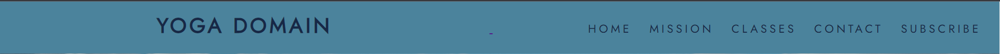
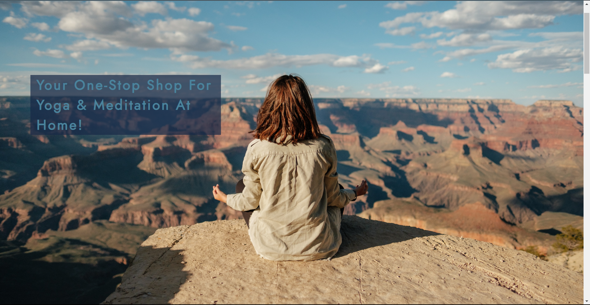
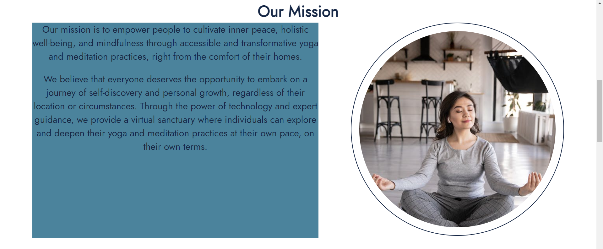
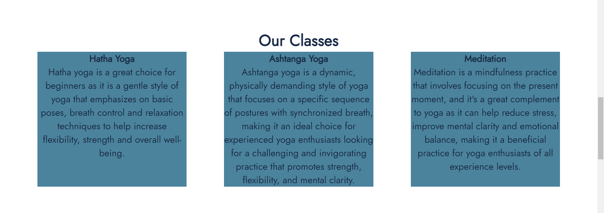
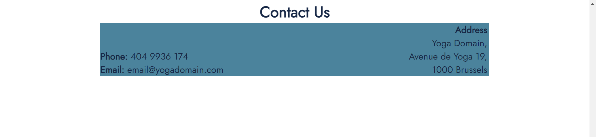
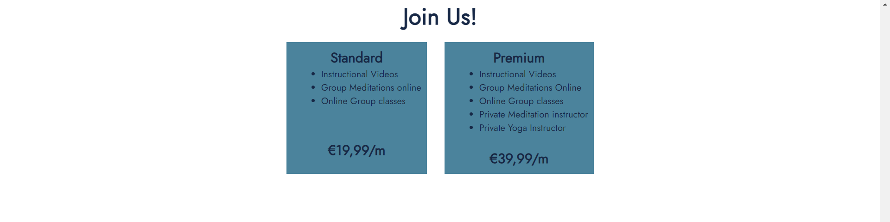
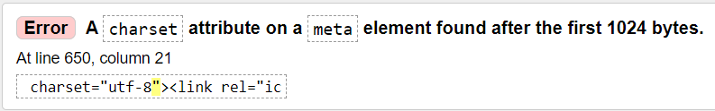

# Yoga Domain 

Yoga Domain is a website that provides online videos with instructions to help users do yoga and meditation 
from the comfort of their own home. As the tagline on the home page says, it's "your one-stop shop for yoga and 
meditation at home". 
![](

On the Website, users will be able to watch videos that they can follow along to. This content is accessible from 
anywhere in the world, and users can participate in their own time. However, they can also participate in group 
activities online such as meditation and yoga classes with a private instrustor. Users can take part in a group
with other people, or by themselves with their own instructor depending on which subscription bundle they choose. 

## Features 

* ### Navigation 
* The navigation bar located at the top of the page has the website logo "YOGA DOMAIN" on the left.
* This logo is also a link that sends the user to the home page when it is clicked. 
* On the right side of the navigation bar is the menu. Within it there are clickable links titled: HOME, MISSION, CLASSES, CONTACT, SUBSCRIBE.
* Each link also has an aria-label in order to be accessible for visually impaired users.
* The font used here and throughout the website is called "JOST". It was chosen because it is spacious and bold, which felt synonymous with yoga and meditation as they are about breathing and streatching.  

## The Header 

* ### The Home Page 
* This page is very simple as it showes an image that spans the width of the screen. 
* The image is a woman meditating with her back toward the user as she stair at a large and expansive landscape.
* the landscape gives the feeling of entering a large space that gives the user room to breathe and expand (or stretch) with no limits, much like the font. 

## The Mission 

* ### Our Mission 
* The mission section of the page gives two brief sentences which highlight the reson for the website's existance, and how it can be benificial for users to join and participate. 
* This statement is seen on the left side of the section, on the right side is an image to accompany and compliment the mission statement. 
* The photo on the right is a woman who is meditating peacefully and is visibly happy doing so in the comfort of her own home. 

## The Classes 

* ### Our Classes 
* This section provides the user with crucial information about the different types of activities available regarding yoga and meditation.
* This is the main informative section which teaches users the difference between meditation, "hatha" and "ashtanga" yoga , and informs them of the difficulty levels they might expect from each one. 
* The information is devided into three horizontaly aligned sections in the form of square cards in order to make it easily digestible, so as not to overwhelm the users. 

## Contact Information 

* ### Contact US 
* The contanct section is fairly simple, containing a horizontal div with three main pieces of information. 
* There is am email, phone number and address. 
* As this is an online business, it wouldn't tipically need a physical address, but it was added here in order to hav emore information to put on the page. 

## The Form 

* ## Join Us 
* This is one of the larger sections, as it starts with two horizontally aligned cards with extra information about the subscription bundles available. 
* Here users can see the specific services offere. 
* On the left side witht the "Standard" option, the customer pays €19,99 per month for instructional yoga videos, and group yoga and meditation sessions online. 
* Om the right there is the premium option for €39,99 per month, with comes with extra services such as a private instructor for yoga and meditation. 
* Below these cards is the sign up form that collects details about the users should they decide to purchase the service. 

## Testing 

* The website was tested on microsoft edge as well as google chrome. 
* It is confirmed that the navigation menu works as desired, and clicking on each link will guide you to the seperate sections of the page, with the title landing at the top of the section. 

## Bugs 

* ### Solved Bugs 

## Validator Testing 
* ### HTML
* One error was found on the html checking tool: 

* ### CSS
* * No erros were found on the WC3 CSS validation service. 

* ### Accessibility 
* The website passed the accessibility test on lighthouse.

* ### Unsolved Bugs 
* The navigation bar has a small mark in the middle that seems to be part of the <nav> element that turns the logo into a clickable link.
* I was not able to fix the error from the html testing. The charset element is an important part of the html fil and I could not determine
  why the testing flagged it as an error. 

## Deployment 
  
* I managed to deploy the website on github through the github pages section.
* I chose to deploy the site through the main branch. 
  
## Credit 
  ### Content 
  * The code for the footer and the form were taken from the coders soffeehouse project.
  * The code for the Navbar and Hero image were taken from the love running project. 
  * The flex boxes used were thanks to instrustion from the tutors at Code Institute. 
  
  ### Media 
  
  * All of the images used on this website were from [Pexels](https://www.pexels.com/) 

